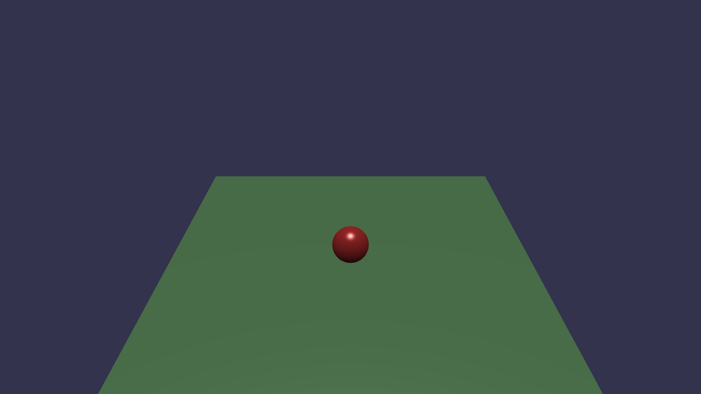

# Day 1 — プロジェクト基盤構築 & Havok 物理エンジン動作確認

## 作業ログ

### プロジェクト初期化
- Vite + TypeScript + Babylon.js 9.x の環境を構築した
- `@babylonjs/core`・`@babylonjs/havok`・`@babylonjs/materials` を依存関係として追加
- WebGPU 対応エンジン（フォールバック: WebGL2）を実装した
- ArcRotateCamera・HemisphericLight を配置して基本シーンを完成させた

### Havok 物理エンジンの初期化
- `HavokPhysics()` で WASM モジュールを非同期ロードした
- `HavokPlugin` を生成し、`scene.enablePhysics(new Vector3(0, -9.81, 0), havokPlugin)` で重力（-9.81 m/s²）を設定した

### 動作確認シーン
- **Ground**: `MeshBuilder.CreateGround` で 10×10 の地面を作成し、`PhysicsAggregate(mass: 0)` で静的剛体にした
- **Sphere**: `MeshBuilder.CreateSphere` で直径 1 の球体を高さ 6 に配置し、`PhysicsAggregate(mass: 1)` で動的剛体にした
- 球体が重力に従って落下し、地面に衝突することを確認した ✅

### スクリーンショット

球体が落下して地面（Plane）に着地した瞬間:

> **緑の地面 (Ground)**: 静的剛体（mass = 0）— 動かない  
> **赤い球体 (Sphere)**: 動的剛体（mass = 1）— 重力に従って落下し地面に衝突

### 確認事項
- [x] Havok WASM の非同期ロード成功
- [x] `scene.enablePhysics` で重力有効化
- [x] Ground が静的剛体として機能（落下しない）
- [x] Sphere が重力（-9.81 m/s²）に従って落下
- [x] Sphere と Ground の衝突を確認
- [x] WebGL2 フォールバックで安定動作（60fps）
